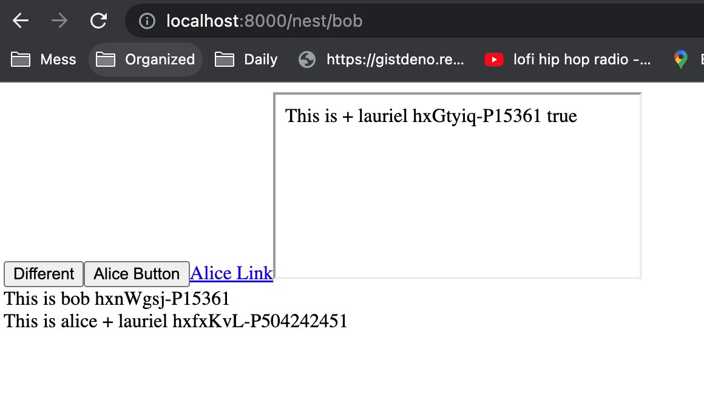
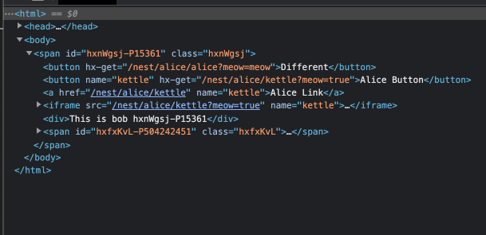

# HTMX Components

I think of it as:
1. Async Server Components 
2. HTMX in JSX (Fully typed JSX for all HTMX attributes without the `hx` prefix.)
3. Dynamic routing / nesting / serving (no files / folders)

## "Click To Edit" Example

This example acts as the "rosetta stone" it's a near 1:1 with the first exmaple in the HTMX docs:

* Start the server `deno task click-to-edit`
* Original HTMX code found here: https://htmx.org/examples/click-to-edit/
* Open the file locally `code ./examples/1.click-to-edit.tsx`
* Navigate to http://localhost:8000/contacts/1
* Navigate to http://localhost:8000/contacts/1/edit

---

<details>
<summary>Default Example (more chaotic example)</summary>

* `deno task start`
* http://localhost:8000/nest/bob
* http://localhost:8000/nest/alice/matt
* http://localhost:8000/registry/@reggi/alicebob

# Default Example:



w
```tsx
import { HTMX, HTMXComponents, serve, Fragment } from "./mod.tsx"

// http://localhost:8000/registry/@reggi/alicebob
const { component, routes, context } = new HTMXComponents('@reggi/alicebob')

const Alice = component('/alice/:name', async ({ name }: { name: string}, ctx) => {
  const _name = await Promise.resolve(name)
  const req = new URL(ctx.request.url)
  const query = req.searchParams.get('meow')
  return (
    <div>
      <div>This is {_name} + {ctx.data.love} {ctx.id} {query}</div>
    </div>
  )
})

const Bob = component('/bob', async (_p, ctx) => {
  const name = await Promise.resolve('bob')
  return (
    <Fragment>
      <HTMX.button get={Alice.getPath(ctx, { name: 'alice' }, { meow: 'meow' })}>Different</HTMX.button>
      <Alice.button.get name={'kettle'} query={{meow: true}}>Alice Button</Alice.button.get>
      <Alice.anchor.href name={'kettle'} useQuery>Alice Link</Alice.anchor.href>
      <Alice.iframe.src name={'kettle'} query={{meow: true}} useQuery>Alice Link</Alice.iframe.src>
      <div>This is {name} {ctx.id}</div>
      <Alice name="alice"/>
    </Fragment>
  )
})

const e = context({
  nestPath: '/nest',
  love: 'lauriel'
})

await serve(e)

// or 
// export default routes // like express routes
```

</details>


